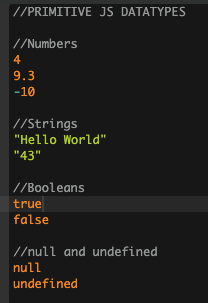
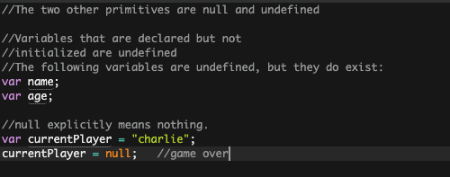
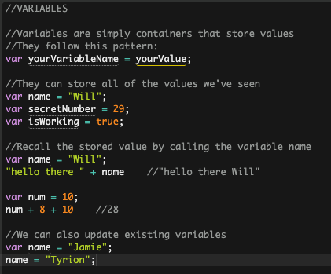
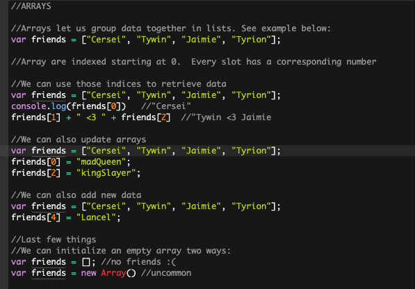
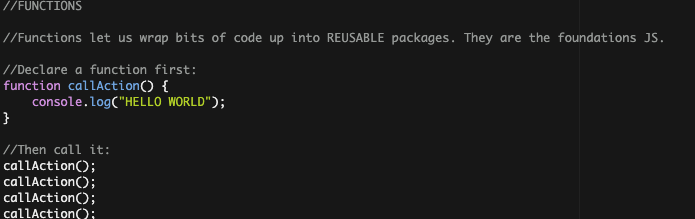
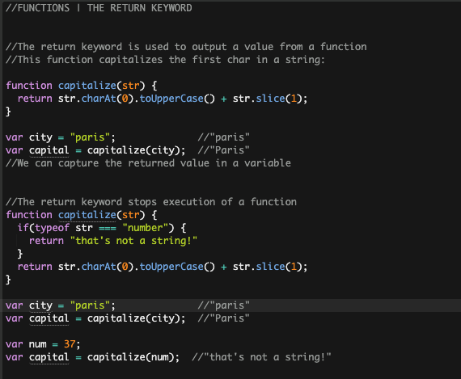
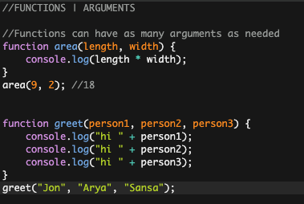
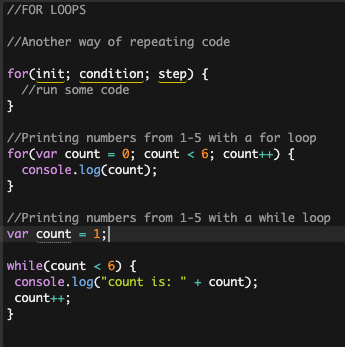
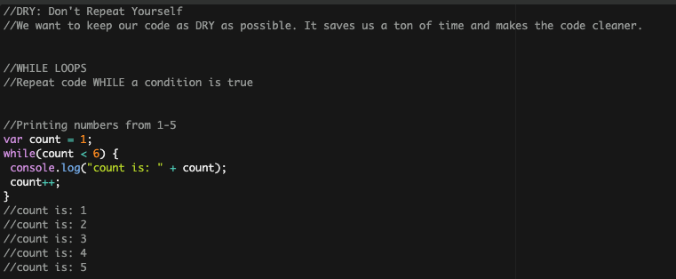

# Vanilla JavaScript 

#### This repository aims to educate on the basics of the JavaScript. 

### Primitive Datatypes

### Null and Undefined

### Variables

### Arrays 

### Functions

### For Loops

### While Loops

